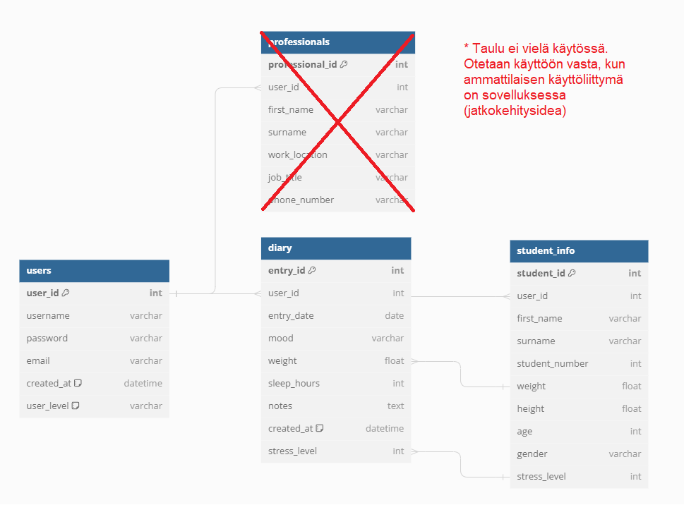

# ZenBeat 

ZenBeat on stressinseurantasovellus, jonka käyttöön vaaditaan Kubios-tili, koska HRV-data haetaan Kubioksesta. 
Nodejs + Express sovellus.

### Projekti: Terveyssovelluksen kehitys, Metropolia Ammattikorkeakoulu
**Ryhmä 5**

> [!NOTE] 
> - [Linkki sovelluksen verkkosivulle](https://zenbeat.northeurope.cloudapp.azure.com/)
> - [Linkki sovelluksen API-dokumentaatioon](https://zenbeat.northeurope.cloudapp.azure.com/docs/)
> - [Sovelluksen rautalankamallit](https://imgur.com/a/9DV8Moe)

# Tietokannan rakenne

# Sovelluksen käyttöliittymän kuvat

# Sovelluksen toiminnallisuudet

- **Responsiivisuus** - Sovelluksen käyttöliittymässä on otettu huomioon responsiivisuus, ja sitä voi käyttää haluamallaan laitteella, kuten mobiililla, tabletilla tai tietokoneella.

- **Sovelluksen navigointipalkki** - Sovelluksella on oma navigointipalkki tietokoneille ja mobiililaitteille.

- **Kirjautuminen** - Sovellukseen kirjaudutaan Kubios-käyttäjätunnuksella.

- **Esitietojen täyttö** - Kun käyttäjä kirjautuu sovellukseen tunnuksellaan ensimmäistä kertaa, hänen pyydetään täytettävän esitiedot.

- **Esitietojen muokkaaminen** - Käyttäjä voi halutessaan muokata esitietojaan navigointipalkin oikeasta yläkulmasta klikkaamalla.

- **Etusivun minikuva (''buddha'')** - Bannerin alaosassa animoitu pyörimisefekti.

- **Etusivulla näkyvät viimeisimmät tapahtumat** - Viimeisin päiväkirjamerkintä ja mittaustulos esitetty käyttäjälle.

- **Etusivun alaosa** - Näytetään satunnainen motivaatiolause API:n kautta (ks. referenssit).

- **Päiväkirjamerkinnän lisääminen** - Käyttäjä pystyy lisäämään uuden päiväkirjamerkinnän.

- **Päiväkirjamerkintöjen tarkastelu** - Käyttäjä näkee kalenterista päivät, joissa on jo merkintöjä. Päivät näkyvät maalattuna kalenterissa.

- **Päiväkirjamerkintöjen muokkaaminen ja poistaminen** - Käyttäjä voi halutessaan muokata tai poistaa merkinnän. Ensin täytyy valita kalenterista päivä, jonka haluaa muokata tai poistaa.

- **Datan kuvaaja** - Data-sivulla näkyy käyttäjän Kubioksesta haettu data kuvaajassa. Käyttäjä voi halutessaan lisätä tai vähentää näkyvien mittauspäivien määrää kuvaajan alaosasta sekä pystyy rajaamaan dataa vaihtamalla kuvaajaa alapalkin valikosta. Infokuvakkeesta lisätietoja klikkaamalla.

- **Maksimiarvot datasta** - Käyttäjä näkee maksimiarvonsa kuvaajan alapuolella.

- **Dataparametrien selitteet** - Käyttäjä voi halutessaan tarkastella dataparametrien selitteitä maksimiarvojen alapuolelta klikkaamalla ''Show more'' ikonia.

- **Info-sivun ZenBot** - ZenBot (ChatBot) on luotu käyttämällä ChatGPT OpenAI apia. Keskustelubotti, joka toimii samalla periaatteella kuin käyttäisi ChatGPT:tä. Infokuvakkeesta lisätietoja klikkaamalla.

- **Info-sivun käyttöohjeet** - Käyttöohjeet saa auki klikkamaalla ''Käyttöohjeet'' painiketta.

- **Työkalut** - Käyttäjä voi klikata haluamaansa työkalua, josta avautuu lisätietoja eri harjoituksista.

# Tiedossa olevat bugit ja ongelmat
- Ei tiedossa olevia

# Käyttö omassa paikallisympäristössä

1. Kloonaa/lataa koodi
2. Suorita npm i projektikansiossa
3. Asenna ja käynnistä MySQL/MariaDB-palvelin
4. Tuo tietokannan skriptit db/ kansioon
5. Luo .env-tiedosto .env.sample-pohjan perusteella
6. Käynnistä kehityspalvelin: npm run dev / npm start

> [!NOTE]
> ZenBot käyttää OpenAI Api avainta. Se täytyy itse luoda OpenAI verkkosivulta, jotta sitä voi käyttää.

# Automaatiotestaukset
[Testauskansio](https://github.com/jerekarp/hyte-projekti24/tree/main/testaus)

Testien logit ja reportit katsottavissa allanäkyvistä linkeistä.

### FRONT testit

**UC_2 Kirjautuminen sovellukseen**

- [Login Report](https://jerekarp.github.io/)
- [Login Log](https://jerekarp.github.io/login_log.html)

---

**UC_3 Sovelluksen käyttö-ohjeisiin perehtyminen**

- [User Manual Report](https://jerekarp.github.io/user_manual_report.html)
- [User Manual Log](https://jerekarp.github.io/user_manual_log.html)

---

**UC_4 Sovelluksen käyttäjän esitietojen täyttäminen**

- [Esitietojen täyttö Report](https://jerekarp.github.io/esitiedot-report.html)
- [Esitietojen täyttö Log](https://jerekarp.github.io/esitiedot-log.html)

---
  
**UC_6 HRV-datan tarkastelu**

- [Data Analysis Report](https://jerekarp.github.io/data_analysis_report.html)
- [Data Analysis Log](https://jerekarp.github.io/data_analysis_log.html)

---

**UC_7 Päiväkirjamerkintöjen lisääminen**

- [Diary Report](https://jerekarp.github.io/diary-report.html)
- [Diary Log](https://jerekarp.github.io/diary-log.html)

- [Diary Update Report](https://jerekarp.github.io/updateDiaryForm-report.html)
- [Diary Update Log](https://jerekarp.github.io/updateDiaryForm-log.html)

---

**UC_9 Stressinhalinta-työkaluihin perehtyminen**

- [Tools Report](https://jerekarp.github.io/tools_report.html)
- [Tools Log](https://jerekarp.github.io/tools_log.html)

---

**UC_10 Uloskirjautuminen**

- [LogOut Report](https://jerekarp.github.io/logout_report.html)
- [LogOut Log](https://jerekarp.github.io/logout_log.html)

### BACK testit

- [OpenAI Api Report](https://jerekarp.github.io/openai_report.html)
- [OpenAI Api Log](https://jerekarp.github.io/openai_log.html)

- [Muokkaa päiväkirjamerkintä Report](https://jerekarp.github.io/muokkaa_merkinta_report.html)
  
- [Poista päiväkirjamerkintä Report](https://jerekarp.github.io/poista_merkinta_report.html)
- [Poista päiväkirjamerkintä Log](https://jerekarp.github.io/poista_merkinta_log.html)

- [Hae päiväkirjamerkintä Report](https://jerekarp.github.io/hae_merkinta_report.html)
- [Hae päiväkirjamerkintä Log](https://jerekarp.github.io/hae_merkinta_log.html)

# Referenssit

- [Kirjautumissivun HTML5 pohja](https://html5up.net/highlights) | html5up.net | **@ajlkn**
- [Footer](https://www.codewithfaraz.com/content/271/create-an-animated-footer-with-html-and-css-source-code)
- Taustakuvat GPT-4.0
- ZenBot käytettiin OpenAI Api 
- Etusivun motivaatiolauseet [type.fit Api](https://forum.freecodecamp.org/t/free-api-inspirational-quotes-json-with-code-examples/311373)
- Ikonit [flaticonista](https://www.flaticon.com/) ja bootstrapista
- Terveydenhuollon ammattilaisen kuva https://unsplash.com/
- [Kalenterin koodiesimerkki](https://medium.com/@bijanrai/create-a-calendar-using-html-css-and-javascript-2a35eb7e5f5a)
- Datasivun kuvaaja tehty [chart.js](https://www.chartjs.org/)
- Youtube Embed
